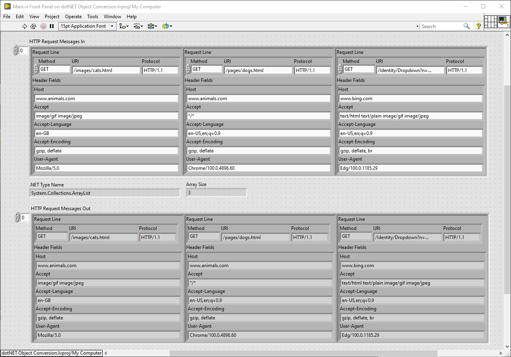
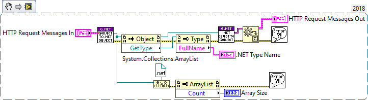

# G Object to dotNET - Convert Clusters, Nested Clusters and Array of Clusters
A project with LabVIEW VIs for converting clusters, nested clusters and array of clusters G Objects to and from .NET Objects.

G Objects that are clusters are converted to and .NET an ArrayList and an ArrayList can be converted into Cluster.

**The Project includes the following tools/VIs:**

- [x] GObject to .NET Object.vi
- [x] .NET Object to GObject.vi
- [x] Main.vi

# Minimum Requirements
* LabVIEW 2018 (32/64 bit)

# Code Snippets

 **Main.vi:**

Example VI shows an array of clusters representing a HTTP Request message being converted to a .NET Object and back to a G Object.

